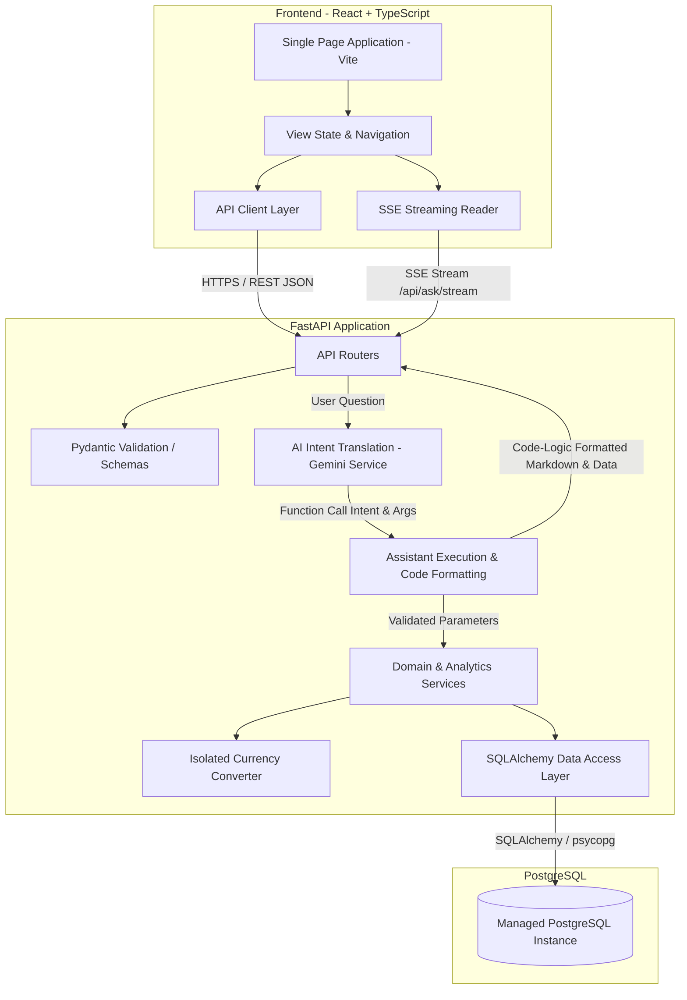
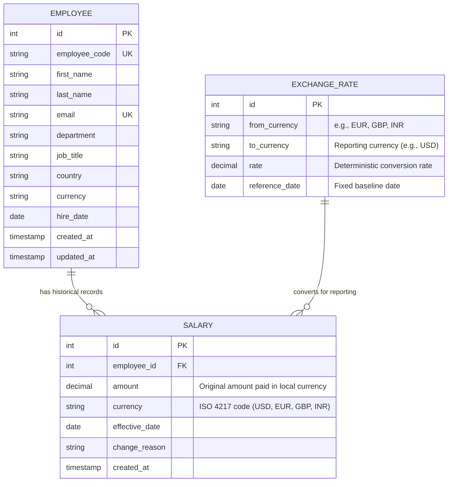
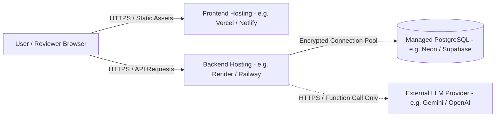

# System Architecture & Design Specification

This document details the architecture, domain model, database schema, API design, deployment structure, and the **AI Compensation Assistant** for the **ACME Salary Management System**.

---

## 1. System Overview

The ACME Salary Management System is a web-based compensation management platform designed for ACME's **HR Manager**. It replaces spreadsheet-based workflows for approximately 10,000 employees distributed across multiple countries.

The primary system goals are:
* Provide reliable, fast access to employee records with server-side filtering, sorting, and pagination.
* Enforce an immutable, append-only salary history model so that previous salary records are never overwritten.
* Support multi-country compensation by preserving original local salary amounts while enabling normalized organizational analytics in a common reporting currency.
* Provide organizational compensation analytics derived directly from database queries.
* Provide a **Zero-Trust AI Compensation Assistant** for natural-language queries that translates user questions into safe, structured database operations without compromising employee data privacy or mathematical accuracy.
* Deliver a responsive, real-time user experience via Server-Sent Events (SSE) streaming and interactive data visualization.
* Maintain an understandable, maintainable architecture with low operational complexity.

---

## 2. Architecture Style

The application is structured as a **Modular Monolith**.



### Architectural Rationale
* A modular monolith provides strong transactional consistency, straightforward local development, and unified testing.
* For ~10,000 employees and an HR Manager persona, distributed systems (such as microservices or message queues) introduce operational overhead, eventual consistency issues, and distributed deployment complexity without concrete technical justification.
* Logical boundaries within the application ensure clear separation of concerns without requiring physical service boundaries.

---

## 3. Technology Stack

| Layer | Technology | Selection Rationale |
| :--- | :--- | :--- |
| **Frontend** | React 19, Vite, TypeScript, Material-UI (MUI v6) | Modern, performant UI library with strong static typing, enterprise design components, and instant hot reloading. |
| **Backend** | Python 3.12+, FastAPI, Poetry | High-performance asynchronous-ready web framework with automatic OpenAPI documentation and strict Pydantic v2 validation. Dependency management via Poetry. |
| **ORM / Data Access** | SQLAlchemy 2.0 | Explicit query construction, clean transactional management, and protection against SQL injection. |
| **Database** | PostgreSQL 16 | Robust relational database with transactional integrity, decimal precision, rich analytical functions (`PERCENTILE_CONT`), and composite B-tree indexes. |
| **AI Integration** | Google Gemini Function Calling (`gemini-3.7-flash`) | Zero-Trust natural language intent parsing. The model only receives function schemas and outputs parameters. It has **zero database access**, never executes SQL, and never sees employee data. |
| **Streaming Protocol** | Server-Sent Events (SSE) | Lightweight, unidirectional HTTP streaming (`POST /api/ask/stream`) for real-time status updates and token-by-token text delivery without WebSocket overhead. |
| **Testing** | pytest (60 tests), Vitest (53 tests) — **113 Total Tests** | Fast, deterministic test execution for backend domain/API logic and frontend UI components. Mocked AI adapters for 100% deterministic test runs without live API keys. |

---

## 4. Layer Responsibilities

```text
backend/
├── app/
│   ├── api/          # HTTP routing, request parsing, response status codes
│   ├── core/         # Configuration, environment settings, application constants
│   ├── db/           # Database engine, session management, base declarative models
│   ├── domain/       # Core business entities, validation rules, invariants
│   └── services/     # Business logic, query orchestration, currency conversion, AI translation
├── migrations/       # Alembic schema versioning scripts
├── scripts/          # Deterministic seed scripts
└── tests/            # Automated unit and integration tests
```

* **API Layer (`app/api/`):** Exposes HTTP endpoints, parses query parameters, handles HTTP status codes, and translates exceptions to standardized error responses. Does not contain business rules or direct SQL statements.
* **Service Layer (`app/services/`):** Orchestrates business use cases, coordinates repository queries, houses the isolated currency conversion service and the AI intent-mapping service, and handles transactions.
* **Domain / Schemas (`app/domain/`):** Encapsulates data validation rules, Pydantic input/output schemas, and business invariants (such as valid salary amounts and effective dates).
* **Data Access Layer (`app/db/`):** Houses SQLAlchemy models, database session lifecycles, and database-level query definitions.

---

## 5. Domain Model & Entities

The domain centers on three core entities: **Employee**, **Salary**, and **ExchangeRate**.



### Business Rules & Invariants
1. **Employee Identity:** Each employee has an immutable system `id`, a unique corporate `email`, and a human-readable unique `employee_code` (e.g., `EMP-00101`).
2. **Native Currency Storage:** Salaries are stored strictly in the currency the employee is actually paid in. The original amount and currency are never overwritten or mutated during reporting conversions.
3. **Salary Immutability:** Salary records are **append-only**. Once created, a salary record is never updated or deleted.
4. **Current Salary Resolution:** An employee's current active salary is defined as the salary record associated with that employee having the most recent `effective_date <= CURRENT_DATE`.
5. **Salary Value Validity:** Salary amounts must be positive values (`amount > 0`).
6. **Reporting Currency Normalization:** When performing aggregate compensation calculations (e.g., total organizational payroll, average salary by department), local salaries are converted to a common reporting currency using deterministic exchange rates.

---

## 6. Database Design (PostgreSQL)

### 6.1 Schema Definitions

#### Table: `employees`
Stores employee profile and organizational metadata.

| Column | Type | Constraints | Description |
| :--- | :--- | :--- | :--- |
| `id` | `INTEGER` | `PRIMARY KEY GENERATED ALWAYS AS IDENTITY` | Internal database identifier |
| `employee_code` | `VARCHAR(32)` | `NOT NULL UNIQUE` | Business employee code (e.g., `EMP-01429`) |
| `first_name` | `VARCHAR(100)` | `NOT NULL` | Given name |
| `last_name` | `VARCHAR(100)` | `NOT NULL` | Family name |
| `email` | `VARCHAR(255)` | `NOT NULL UNIQUE` | Corporate email address |
| `department` | `VARCHAR(100)` | `NOT NULL` | Department assignment |
| `job_title` | `VARCHAR(100)` | `NOT NULL` | Job designation |
| `country` | `VARCHAR(100)` | `NOT NULL` | Country of employment |
| `currency` | `VARCHAR(3)` | `NOT NULL` | ISO 4217 contract currency code |
| `hire_date` | `DATE` | `NOT NULL` | Employment start date |
| `created_at` | `TIMESTAMPTZ` | `NOT NULL DEFAULT CURRENT_TIMESTAMP` | Audit timestamp |
| `updated_at` | `TIMESTAMPTZ` | `NOT NULL DEFAULT CURRENT_TIMESTAMP` | Modification timestamp |

#### Table: `salaries`
Stores append-only compensation records in the employee's native paid currency.

| Column | Type | Constraints | Description |
| :--- | :--- | :--- | :--- |
| `id` | `INTEGER` | `PRIMARY KEY GENERATED ALWAYS AS IDENTITY` | Internal database identifier |
| `employee_id` | `INTEGER` | `NOT NULL REFERENCES employees(id) ON DELETE CASCADE` | Foreign key to employee |
| `amount` | `NUMERIC(12, 2)` | `NOT NULL CHECK (amount > 0)` | Original salary amount paid in local currency |
| `currency` | `VARCHAR(3)` | `NOT NULL` | ISO 4217 code (e.g., `USD`, `EUR`, `GBP`, `INR`) |
| `effective_date` | `DATE` | `NOT NULL` | Date when the salary became effective |
| `change_reason` | `VARCHAR(100)` | `NULL` | Reason for change (e.g., Initial, Raise, Promotion) |
| `created_at` | `TIMESTAMPTZ` | `NOT NULL DEFAULT CURRENT_TIMESTAMP` | Timestamp of record creation |

#### Table: `exchange_rates`
Stores deterministic reference exchange rates for converting local currencies to a reporting currency.

| Column | Type | Constraints | Description |
| :--- | :--- | :--- | :--- |
| `id` | `INTEGER` | `PRIMARY KEY GENERATED ALWAYS AS IDENTITY` | Internal database identifier |
| `from_currency` | `VARCHAR(3)` | `NOT NULL` | Source currency code (e.g., `EUR`, `GBP`, `INR`) |
| `to_currency` | `VARCHAR(3)` | `NOT NULL` | Target reporting currency code (e.g., `USD`) |
| `rate` | `NUMERIC(12, 6)` | `NOT NULL CHECK (rate > 0)` | Conversion multiplier (`amount * rate = converted_amount`) |
| `reference_date` | `DATE` | `NOT NULL` | Fixed baseline reference date ensuring reproducibility |

*Constraint:* `UNIQUE (from_currency, to_currency, reference_date)`

---

### 6.2 Indexing Strategy

Indexes are limited strictly to demonstrated query and access patterns:

```sql
-- 1. Accelerates employee list filtering by department
CREATE INDEX idx_employees_department ON employees (department);

-- 2. Accelerates employee list filtering by country
CREATE INDEX idx_employees_country ON employees (country);

-- 3. Composite index for salary history lookup and current salary resolution
CREATE INDEX idx_salaries_emp_effective ON salaries (employee_id, effective_date DESC);

-- 4. Fast lookup for currency conversion pairs
CREATE INDEX idx_exchange_rates_pair ON exchange_rates (from_currency, to_currency);
```

---

## 7. Salary History Design

Preserving salary history is a confirmed core requirement.

### Mechanism
* When an employee is created, an initial record is written to `salaries` in their paid currency.
* When an employee receives a salary adjustment, a new row is appended to `salaries` containing the new `amount`, `effective_date`, and optional `change_reason`.
* Previous salary rows are untouched, preserving complete auditability.

### Querying Current Salary
To retrieve the current salary for an individual employee:
```sql
SELECT amount, currency, effective_date, change_reason
FROM salaries
WHERE employee_id = :employee_id
  AND effective_date <= CURRENT_DATE
ORDER BY effective_date DESC, id DESC
LIMIT 1;
```

To resolve current salaries for a paginated list of employees without N+1 queries, the query uses a single query with `DISTINCT ON` across the fetched employee IDs:
```sql
SELECT DISTINCT ON (employee_id)
    employee_id, amount, currency, effective_date
FROM salaries
WHERE employee_id = ANY(:employee_ids)
  AND effective_date <= CURRENT_DATE
ORDER BY employee_id, effective_date DESC, id DESC;
```

---

## 8. Multi-Currency Architecture & Normalization

To support employees across multiple countries without corrupting compensation records, the system implements a **dual-view multi-currency model**:

### 1. Native Currency Storage (Employee Operations)
* Every employee's salary is stored strictly in the currency they are actually paid in (e.g., `1,200,000 INR`, `70,000 EUR`, `80,000 USD`).
* The HR Manager always sees the exact contract salary and local currency on employee profile pages, directory rows, and historical timelines.
* Original values are never modified, rounded, or overwritten by conversion operations.

### 2. Common Reporting Currency Normalization (Organizational Analytics)
* For cross-departmental and cross-country comparisons (e.g., "Average salary by department" or "Total organization payroll"), local salaries are converted to a single common reporting currency (default: `USD`).
* Converted values are calculated on-the-fly during analytics queries and are never persisted back into the `salaries` table.

### 3. Deterministic Reference Rate Table
* Exchange rates are stored in the database with a designated `reference_date`.
* **No hardcoded rates in application code:** Rates are loaded from the database or external configuration.
* **No live / intraday FX dependencies:** Using a deterministic reference table eliminates external network failure points and ensures 100% reproducible tests and seed datasets.

### 4. Isolated Currency Conversion Service
Conversion logic is encapsulated in an isolated service interface (`CurrencyConversionService`):
```python
class CurrencyConversionService:
    def convert(self, amount: Decimal, from_currency: str, to_currency: str) -> Decimal:
        """Converts an amount from one currency to another using reference rates."""
        ...
```
* **Extensibility:** Isolating this logic ensures that the underlying rate source can be## 9. AI Compensation Assistant (Natural-Language Analytics Interface)

### 9.1 Purpose & Zero-Trust Architecture
The AI Compensation Assistant enables the HR Manager to query compensation and workforce metrics using natural language while strictly enforcing a **Zero-Trust Security Boundary**:
* **Zero Database Access:** The AI model is never given database credentials, connection strings, or query execution privileges.
* **Zero SQL Generation:** The AI never generates raw SQL strings, eliminating SQL injection and prompt injection risks.
* **Zero Employee Data Exposure:** The AI is never passed database rows, employee names, emails, salaries, or personally identifiable information (PII). It only receives function tool schemas and user question text.
* **Zero Hallucination:** The AI only extracts query intent and filters. All calculations, rankings, averages, and aggregations are performed natively by PostgreSQL and Python domain services.

```text
                    ZERO-TRUST ARCHITECTURE BOUNDARY

┌────────────────────────┐      User Question      ┌─────────────────────────────┐
│       HR Manager       │ ──────────────────────> │    FastAPI Application      │
│  (React Frontend UI)   │                         │  (app/services/assistant)   │
└────────────────────────┘                         └──────────────┬──────────────┘
            ▲                                                     │
            │ SSE Stream (Tokens + Table Data)                    │ Function Declarations Only
            │                                                     │ (Zero Employee Data)
            │                                                     ▼
┌───────────┴────────────┐                          ┌─────────────────────────────┐
│  Code-Logic Formatter  │                          │    Google Gemini Service    │
│ (Deterministic Python) │                          │     (gemini-3.7-flash)      │
└────────────────────────┘                          └──────────────┬──────────────┘
            ▲                                                     │
            │ Verified Result Set                                 │ Tool Call + Parameters Only
            │                                                     │ (e.g., query_employees)
┌───────────┴────────────┐                                        ▼
│  PostgreSQL 16 Engine  │ <──────────────────────────────────────┘
│ (Parameterized Query)  │    Validated & Sanitized SQL Parameters
└────────────────────────┘
```

---

### 9.2 Tool Declarations & Supported Operations
The AI model maps natural language questions into one of seven strictly typed and validated tool operations:

| Tool Name | Purpose | Key Parameters |
| :--- | :--- | :--- |
| `query_employees` | General multi-employee ranking, filtering, and listing (e.g. "top 50 employees in India", "employees in India > 50K salary, lowest 10") | `country`, `department`, `job_title`, `min_salary`, `max_salary`, `currency`, `sort_by` (`salary`/`name`), `sort_order` (`asc`/`desc`), `limit` (1-100) |
| `get_employee_count` | Headcount metrics across the organization, departments, or countries | `department`, `country` |
| `get_salary_metrics` | Overall, departmental, or regional salary statistics (mean, median, min, max) | `metric` (`average`, `median`, `highest`, `lowest`), `department`, `country` |
| `compare_departments` | Side-by-side compensation and headcount comparison between two departments | `department_a`, `department_b` |
| `compare_countries` | Side-by-side compensation and headcount comparison between two countries/regions | `country_a`, `country_b` |
| `get_salary_range_count`| Workforce distribution count and percentage within a specified salary band | `min_salary`, `max_salary`, `currency` |
| `get_top_earning_employee` | Single highest earner lookup (resolves "Who" vs "What") with profile details | `department`, `country` |

---

### 9.3 Execution Pipeline & Code-Logic Formatting
Once Gemini emits a tool call, the backend execution pipeline operates deterministically:

1. **Parameter Validation & Sanitization:** Parameters emitted by the LLM are validated against known departments, supported country codes, valid sort orders (`asc`/`desc`), and bounded limits (1 to 100).
2. **Parameterized Database Execution:** The backend runs optimized SQL queries via SQLAlchemy with parameters bound safely:
   - For `query_employees`, a Common Table Expression (CTE) with `DISTINCT ON (employee_id)` resolves current active salaries (`effective_date <= CURRENT_DATE`), applies threshold and regional filters, and applies sorting/limits.
3. **Deterministic Code-Logic Formatting:**
   - Rather than passing database rows back to the LLM for a second generative turn (which would violate employee data privacy and risk numerical hallucination), the response is formatted using **pure Python code logic**.
   - Generates human-readable Markdown summaries, contextual insights, and structured data payloads.
   - Attaches an `AI Verified` provenance metadata tag confirming the query operation, record count, and normalization base.

---

### 9.4 Real-Time Server-Sent Events (SSE) Streaming
To deliver a responsive user experience without blocking the server, the assistant provides a streaming endpoint (`POST /api/ask/stream`):

* **Non-Blocking Asynchronous Processing:** The Gemini SDK call and PostgreSQL queries are dispatched to worker threads using `asyncio.to_thread`, keeping FastAPI's event loop completely non-blocking.
* **Event Protocol:**
  - `event: status` — Real-time progress updates (`"Understanding query..."`, `"Executing database analysis..."`, `"Formatting verified response..."`).
  - `event: token` — Incremental tokens of the formatted Markdown response, streamed with natural pacing.
  - `event: data` — Structured JSON payload containing full table data, visualizer configurations, and metadata.
  - `event: done` — Signal marking completion of the stream.
  - `event: error` — Graceful error reporting if an unexpected issue occurs.

---

### 9.5 UI Presentation & Interactive Visualization
The frontend renders responses dynamically based on the returned operation:

1. **Live Thinking Pills & Typing Cursor:** Users see live status chips indicating query analysis and database execution, followed by smooth animated Markdown rendering.
2. **Interactive Employee Data Table (for `query_employees`):**
   - Displays ranked results with Employee Code, Name, Department, Job Title, Country, and Current Salary (both local paid currency and normalized USD).
   - Client-side live search filtering and paginated table navigation.
   - **One-Click CSV Export:** HR managers can instantly export the filtered list to a CSV spreadsheet.
3. **Comparison Visualizers:** Side-by-side comparison tables for departmental or country compensation metrics.
4. **Workforce Share Progress Cards:** Visual percentage and headcount share bars for salary range distribution queries.
5. **Employee Profile Cards:** Highlighting top earners with compensation breakdowns and job details.
6. **Clean Enterprise Design:** All vendor-specific branding is replaced with clean enterprise terminology (`AI Verified`, `Enterprise Database`).

---

### 9.6 Core Architectural Decisions: Why This Design?

#### Decision 1: Structured Tool Calling Instead of RAG / Vector Embeddings
* **Rationale:** ACME's compensation records are structured relational rows in PostgreSQL. Vector similarity search across embeddings cannot compute mathematical sums, medians, rankings, or salary thresholds. RAG is designed for unstructured document search, not mathematical compensation queries.

#### Decision 2: Controlled Tool Whitelist Instead of Raw SQL Generation
* **Rationale:** Allowing an LLM to generate arbitrary SQL creates severe SQL injection risks, date-filtering bugs (e.g. failing to respect `effective_date <= CURRENT_DATE`), and non-deterministic table joins. A bounded tool whitelist guarantees complete database safety and testability.

#### Decision 3: Code-Logic Formatting Instead of Second-Turn LLM Synthesis
* **Rationale:** Sending retrieved employee records back to an LLM for text generation exposes employee PII to third-party APIs and reintroduces hallucination risk. Formatted deterministic Markdown generated by Python ensures 100% data privacy and 100% mathematical fidelity.

#### Decision 4: Server-Sent Events (SSE) Instead of WebSockets
* **Rationale:** Assistant queries are request-response interactions that stream text unidirectionally from server to client. SSE operates over standard HTTP/2, requires no stateful connection management or socket handshake infrastructure, and handles automatic reconnection cleanly.

---

### 9.7 Error Handling & Guardrails
* **Out-of-Scope Guidance:** If a user asks an unsupported question (e.g., general conversation or HR policy), the system returns a polite guidance message with examples of supported compensation queries.
* **Missing Parameters:** When a question lacks necessary context (*"What is the average salary in?"*), the assistant asks for clarification rather than guessing.
* **Graceful Degradation:** The core employee directory, salary history, and visual dashboard have **zero dependency on the AI service**. If the AI provider is unreachable, core business operations remain fully functional.

---

### 9.8 Testing Strategy
* **Deterministic Unit Tests:** Intent parsing is verified using representative query sets against a mocked AI provider in `pytest`, ensuring the test suite executes in milliseconds without live API keys or network latency.
* **Parameterized SQL Tests:** All underlying analytics functions and `query_employees` CTE queries are tested against PostgreSQL fixtures with 100% pass rate.

---

## 10. API Architecture

The backend exposes a JSON REST API and Server-Sent Events stream conforming to standard HTTP semantics.

### Endpoints

#### Employee Management
* `GET /api/employees`: Paginated list of employees. Supports `page`, `page_size`, `search`, `department`, `country`, `sort_by`, `sort_order`. Returns employee details alongside their current active salary in **native paid currency**.
* `GET /api/employees/{id}`: Returns full details for a single employee, showing native salary amount and currency.
* `POST /api/employees`: Registers a new employee and their starting salary record within a single database transaction.

#### Salary History Management
* `GET /api/employees/{id}/salaries`: Returns the chronological list of all historical salary records for the employee in their **native paid currency**, ordered by `effective_date DESC`.
* `POST /api/employees/{id}/salaries`: Appends a new salary record for the employee with a specified `effective_date`, `amount`, and contract `currency`.

#### Organizational Analytics (Normalized to Reporting Currency)
* `GET /api/analytics/overview?reporting_currency=USD`: High-level summary metrics (headcount, total payroll, mean/median salary normalized to reporting currency).
* `GET /api/analytics/by-department?reporting_currency=USD`: Departmental breakdown of headcount and normalized payroll metrics.
* `GET /api/analytics/by-country?reporting_currency=USD`: Regional breakdown showing local employee counts alongside normalized compensation metrics.

#### AI Compensation Assistant
* `POST /api/ask/stream`: **Server-Sent Events (SSE)** endpoint streaming real-time status, text tokens, and structured table data.
  * **Request Body:** `{"question": "Top 50 employees in India based on salary"}`
  * **Streamed Events:**
    - `event: status` -> `{"text": "Executing database analysis..."}`
    - `event: token` -> `{"text": "Here are the top 50 employees in India..."}`
    - `event: data` -> Structured response containing `employees` list, `operation`, and metadata.
* `POST /api/ask`: Standard synchronous REST endpoint returning the complete formatted answer, structured data, and metadata.
  * **Request Body:**
    ```json
    {
      "question": "Which department has the highest average salary?"
    }
    ```
  * **Response Body (200 OK):**
    ```json
    {
      "answer": "Engineering has the highest average salary at 110,000 USD.",
      "operation": "get_highest_average_salary_department",
      "data": {
        "department": "Engineering",
        "average_salary": 110000.00,
        "currency": "USD",
        "headcount": 3400
      },
      "metadata": {
        "based_on": "Current active salary records normalized to USD"
      }
    }
    ```

---

## 11. Frontend Architecture

The frontend is a single-page application built with React, Vite, and TypeScript.

```text
frontend/src/
├── components/
│   ├── layout/         # Header, navigation sidebar, main content shell
│   ├── employees/      # Directory table, search/filter bar, salary history modal, add employee modal
│   ├── analytics/      # Metric cards, department breakdown, country breakdown
│   └── common/         # Loading spinner, error alerts, empty states, pagination
├── pages/
│   ├── EmployeeDirectory.tsx      # Main employee directory with filters and modals
│   ├── AnalyticsDashboard.tsx     # Executive analytics with KPI cards and charts
│   └── CompensationAssistant.tsx  # Natural language compensation assistant with visualizers
├── services/
│   ├── api.service.ts   # Centralized API service wrapping endpoints
│   └── apiClient.ts     # Fetch client with standardized error handling
├── types/
│   ├── employee.ts      # Employee, Salary, and filter types
│   ├── analytics.ts     # Analytics metrics and breakdown types
│   └── assistant.ts     # Natural language request/response types
└── App.tsx              # Root component with tab navigation
```

---

## 12. Security Considerations

Even without full multi-user authentication in MVP scope, strict enterprise security principles are enforced:
1. **Injection Protection:** All database interactions use SQLAlchemy parameterized queries, preventing SQL injection.
2. **Zero-Trust AI Boundary:** The AI model is never given direct SQL access, raw database connections, connection strings, or query execution privileges. It can only emit whitelisted tool declarations that are strictly validated and executed by backend services.
3. **Zero PII / Employee Data Exposure:** Only the user's question string and tool declaration schemas are transmitted to the external LLM provider. The underlying database rows (employee records, PII, names, salaries) are never sent to the LLM. All result formatting, summaries, and tabular presentation are generated by deterministic backend code logic.
4. **Input Validation:** All API inputs are strictly validated through Pydantic models (e.g. positive monetary amounts, valid currency codes, valid email formats).
5. **CORS Configuration:** Production deployments restrict allowed origins to the deployed frontend domain rather than wildcard `*`.
6. **Credential Isolation:** Database connection strings and AI API keys are loaded via environment variables and never committed to version control.

---

## 13. Deployment Architecture

The deployment architecture is intentionally straightforward:



* **Frontend:** Deployed as static assets built with Vite to a modern CDN-backed host (e.g., Vercel or Netlify) pointing to the `frontend/` directory.
* **Backend:** Deployed as a Python web service (e.g., Render, Railway, or Fly.io) running FastAPI via Uvicorn pointing to the `backend/` directory.
* **Database:** Managed PostgreSQL instance (e.g., Neon, Supabase, or Railway PostgreSQL).
* **Configuration:** Frontend connects to the backend through `VITE_API_BASE_URL`. Backend connects to the database through `DATABASE_URL` and optionally configures `AI_API_KEY`.

No container orchestration (Kubernetes), message brokers, or distributed caches are involved.

---

## 14. Architectural Trade-offs Summary

| Choice | Alternative Considered | Rationale |
| :--- | :--- | :--- |
| **Tool Calling / Structured Intent** | Direct LLM SQL Generation | Prevents prompt injection, avoids SQL syntax hallucinations, and keeps database execution predictable and testable. |
| **Relational SQL Queries** | Vector DB / Embeddings (RAG) | Salary and employee data is structured relational data; vector similarity cannot perform mathematical aggregations (sums, averages, percentiles). |
| **Compensation Analytics Q&A Scope** | Full HR Chatbot / Agent | Keeps domain narrow, reliable, testable, and aligned with core salary assessment goals without unnecessary scope creep. |
| **Native Storage + Reporting Normalization** | Convert all salaries to USD upon entry | Preserves actual contract amounts without permanent currency distortion; allows HR to always review true paid amounts. |
| **Deterministic Reference Rates** | Live external Forex API | Avoids third-party network failure points, API rate limits, and non-deterministic test results during evaluation. |
| **Isolated Currency Service** | Hardcoding conversion math in endpoints | Keeps rate sourcing modular; exchange-rate providers can be replaced or updated without modifying core domain logic. |
| **Modular Monolith** | Microservices | Avoids unnecessary distributed systems complexity, network latency, and operational overhead for a 10,000-employee domain. |
| **Append-Only Salaries** | Single Mutable Column | Preserves 100% of historical compensation progression for audits and compliance without overwriting data. |
| **Server-Side Pagination** | Client-Side Filtering | Avoids sending large datasets over the network to the browser, keeping client memory and network bandwidth bounded. |

---

## 15. Future Scalability Considerations

If the organization grows substantially beyond 10,000 employees:
1. **Periodic FX Rate Sync:** The isolated `CurrencyConversionService` can be backed by a scheduled background worker to update the `exchange_rates` table periodically.
2. **AI Tool Expansion:** As new HR requirements emerge, additional analytics tools can be added to the whitelist without restructuring the intent parser.
3. **Keyset / Cursor Pagination:** Can replace offset-based pagination if dataset sizes reach millions of rows where high offset values become inefficient.
4. **Read Replicas:** Read-heavy analytics queries can be routed to a PostgreSQL read replica to isolate analytical workloads from transactional writes.
