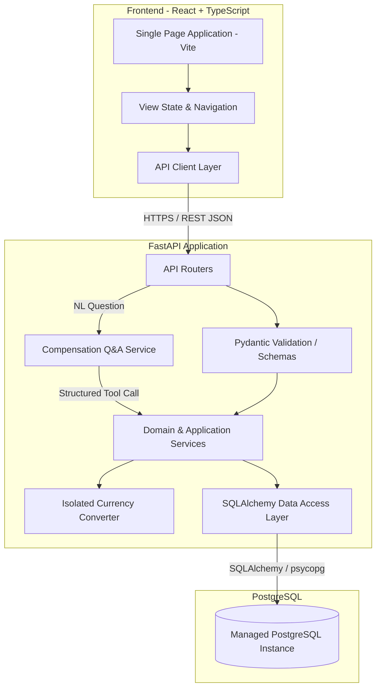
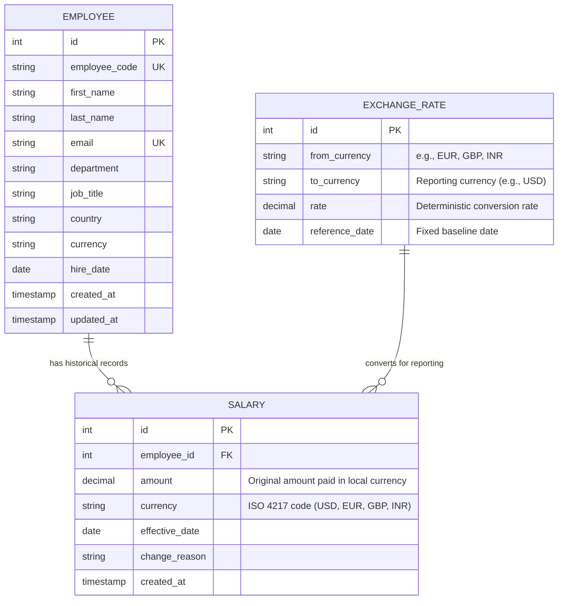
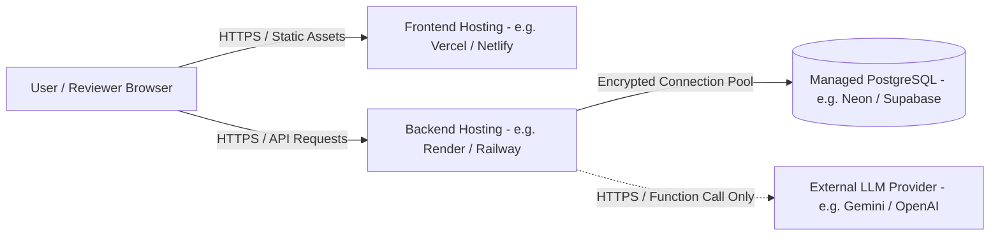

# System Architecture & Design Specification

This document details the architecture, domain model, database schema, API design, deployment structure, and planned **Compensation Q&A** interface for the **ACME Salary Management System**.

---

## 1. System Overview

The ACME Salary Management System is a web-based compensation management platform designed for ACME's **HR Manager**. It replaces spreadsheet-based workflows for approximately 10,000 employees distributed across multiple countries.

The primary system goals are:
* Provide reliable, fast access to employee records with server-side filtering, sorting, and pagination.
* Enforce an immutable, append-only salary history model so that previous salary records are never overwritten.
* Support multi-country compensation by preserving original local salary amounts while enabling normalized organizational analytics in a common reporting currency.
* Provide organizational compensation analytics derived directly from database queries.
* Provide an optional, tightly bounded natural-language interface (**Compensation Q&A**) for compensation questions without compromising data integrity or system reliability.
* Maintain an understandable, maintainable architecture with low operational complexity.

---

## 2. Architecture Style

The application is structured as a **Modular Monolith**.



### Architectural Rationale
* A modular monolith provides strong transactional consistency, straightforward local development, and unified testing.
* For ~10,000 employees and an HR Manager persona, distributed systems (such as microservices or message queues) introduce operational overhead, eventual consistency issues, and distributed deployment complexity without concrete technical justification.
* Logical boundaries within the application ensure clear separation of concerns without requiring physical service boundaries.

---

## 3. Technology Stack

| Layer | Technology | Selection Rationale |
| :--- | :--- | :--- |
| **Frontend** | React, Vite, TypeScript | Modern, performant UI library with strong static typing and standard tooling. |
| **Backend** | Python, FastAPI, Poetry | High-performance asynchronous-ready web framework with automatic OpenAPI documentation and strict Pydantic validation. Dependency management via Poetry. |
| **ORM / Data Access** | SQLAlchemy 2.0 | Explicit query construction, clean transactional management, and protection against SQL injection. |
| **Database** | PostgreSQL | Robust relational database with transactional integrity, rich analytical functions, and strong hosting support. |
| **AI Integration (Planned)** | LLM with Function/Tool Calling | Lightweight SDK abstraction to translate natural-language questions into controlled analytics operations. No vector databases or complex agent frameworks. |
| **Testing** | pytest, Vitest, React Testing Library | Fast, deterministic test execution for backend domain/API logic and frontend UI components. Mocked AI adapters for deterministic test execution. |

---

## 4. Layer Responsibilities

```text
backend/
├── app/
│   ├── api/          # HTTP routing, request parsing, response status codes
│   ├── core/         # Configuration, environment settings, application constants
│   ├── db/           # Database engine, session management, base declarative models
│   ├── domain/       # Core business entities, validation rules, invariants
│   └── services/     # Business logic, query orchestration, currency conversion, AI translation
├── migrations/       # Alembic schema versioning scripts
├── scripts/          # Deterministic seed scripts
└── tests/            # Automated unit and integration tests
```

* **API Layer (`app/api/`):** Exposes HTTP endpoints, parses query parameters, handles HTTP status codes, and translates exceptions to standardized error responses. Does not contain business rules or direct SQL statements.
* **Service Layer (`app/services/`):** Orchestrates business use cases, coordinates repository queries, houses the isolated currency conversion service and the AI intent-mapping service, and handles transactions.
* **Domain / Schemas (`app/domain/`):** Encapsulates data validation rules, Pydantic input/output schemas, and business invariants (such as valid salary amounts and effective dates).
* **Data Access Layer (`app/db/`):** Houses SQLAlchemy models, database session lifecycles, and database-level query definitions.

---

## 5. Domain Model & Entities

The domain centers on three core entities: **Employee**, **Salary**, and **ExchangeRate**.



### Business Rules & Invariants
1. **Employee Identity:** Each employee has an immutable system `id`, a unique corporate `email`, and a human-readable unique `employee_code` (e.g., `EMP-00101`).
2. **Native Currency Storage:** Salaries are stored strictly in the currency the employee is actually paid in. The original amount and currency are never overwritten or mutated during reporting conversions.
3. **Salary Immutability:** Salary records are **append-only**. Once created, a salary record is never updated or deleted.
4. **Current Salary Resolution:** An employee's current active salary is defined as the salary record associated with that employee having the most recent `effective_date <= CURRENT_DATE`.
5. **Salary Value Validity:** Salary amounts must be positive values (`amount > 0`).
6. **Reporting Currency Normalization:** When performing aggregate compensation calculations (e.g., total organizational payroll, average salary by department), local salaries are converted to a common reporting currency using deterministic exchange rates.

---

## 6. Database Design (PostgreSQL)

### 6.1 Schema Definitions

#### Table: `employees`
Stores employee profile and organizational metadata.

| Column | Type | Constraints | Description |
| :--- | :--- | :--- | :--- |
| `id` | `INTEGER` | `PRIMARY KEY GENERATED ALWAYS AS IDENTITY` | Internal database identifier |
| `employee_code` | `VARCHAR(32)` | `NOT NULL UNIQUE` | Business employee code (e.g., `EMP-01429`) |
| `first_name` | `VARCHAR(100)` | `NOT NULL` | Given name |
| `last_name` | `VARCHAR(100)` | `NOT NULL` | Family name |
| `email` | `VARCHAR(255)` | `NOT NULL UNIQUE` | Corporate email address |
| `department` | `VARCHAR(100)` | `NOT NULL` | Department assignment |
| `job_title` | `VARCHAR(100)` | `NOT NULL` | Job designation |
| `country` | `VARCHAR(100)` | `NOT NULL` | Country of employment |
| `currency` | `VARCHAR(3)` | `NOT NULL` | ISO 4217 contract currency code |
| `hire_date` | `DATE` | `NOT NULL` | Employment start date |
| `created_at` | `TIMESTAMPTZ` | `NOT NULL DEFAULT CURRENT_TIMESTAMP` | Audit timestamp |
| `updated_at` | `TIMESTAMPTZ` | `NOT NULL DEFAULT CURRENT_TIMESTAMP` | Modification timestamp |

#### Table: `salaries`
Stores append-only compensation records in the employee's native paid currency.

| Column | Type | Constraints | Description |
| :--- | :--- | :--- | :--- |
| `id` | `INTEGER` | `PRIMARY KEY GENERATED ALWAYS AS IDENTITY` | Internal database identifier |
| `employee_id` | `INTEGER` | `NOT NULL REFERENCES employees(id) ON DELETE CASCADE` | Foreign key to employee |
| `amount` | `NUMERIC(12, 2)` | `NOT NULL CHECK (amount > 0)` | Original salary amount paid in local currency |
| `currency` | `VARCHAR(3)` | `NOT NULL` | ISO 4217 code (e.g., `USD`, `EUR`, `GBP`, `INR`) |
| `effective_date` | `DATE` | `NOT NULL` | Date when the salary became effective |
| `change_reason` | `VARCHAR(100)` | `NULL` | Reason for change (e.g., Initial, Raise, Promotion) |
| `created_at` | `TIMESTAMPTZ` | `NOT NULL DEFAULT CURRENT_TIMESTAMP` | Timestamp of record creation |

#### Table: `exchange_rates`
Stores deterministic reference exchange rates for converting local currencies to a reporting currency.

| Column | Type | Constraints | Description |
| :--- | :--- | :--- | :--- |
| `id` | `INTEGER` | `PRIMARY KEY GENERATED ALWAYS AS IDENTITY` | Internal database identifier |
| `from_currency` | `VARCHAR(3)` | `NOT NULL` | Source currency code (e.g., `EUR`, `GBP`, `INR`) |
| `to_currency` | `VARCHAR(3)` | `NOT NULL` | Target reporting currency code (e.g., `USD`) |
| `rate` | `NUMERIC(12, 6)` | `NOT NULL CHECK (rate > 0)` | Conversion multiplier (`amount * rate = converted_amount`) |
| `reference_date` | `DATE` | `NOT NULL` | Fixed baseline reference date ensuring reproducibility |

*Constraint:* `UNIQUE (from_currency, to_currency, reference_date)`

---

### 6.2 Indexing Strategy

Indexes are limited strictly to demonstrated query and access patterns:

```sql
-- 1. Accelerates employee list filtering by department
CREATE INDEX idx_employees_department ON employees (department);

-- 2. Accelerates employee list filtering by country
CREATE INDEX idx_employees_country ON employees (country);

-- 3. Composite index for salary history lookup and current salary resolution
CREATE INDEX idx_salaries_emp_effective ON salaries (employee_id, effective_date DESC);

-- 4. Fast lookup for currency conversion pairs
CREATE INDEX idx_exchange_rates_pair ON exchange_rates (from_currency, to_currency);
```

---

## 7. Salary History Design

Preserving salary history is a confirmed core requirement.

### Mechanism
* When an employee is created, an initial record is written to `salaries` in their paid currency.
* When an employee receives a salary adjustment, a new row is appended to `salaries` containing the new `amount`, `effective_date`, and optional `change_reason`.
* Previous salary rows are untouched, preserving complete auditability.

### Querying Current Salary
To retrieve the current salary for an individual employee:
```sql
SELECT amount, currency, effective_date, change_reason
FROM salaries
WHERE employee_id = :employee_id
  AND effective_date <= CURRENT_DATE
ORDER BY effective_date DESC, id DESC
LIMIT 1;
```

To resolve current salaries for a paginated list of employees without N+1 queries, the query uses a single query with `DISTINCT ON` across the fetched employee IDs:
```sql
SELECT DISTINCT ON (employee_id)
    employee_id, amount, currency, effective_date
FROM salaries
WHERE employee_id = ANY(:employee_ids)
  AND effective_date <= CURRENT_DATE
ORDER BY employee_id, effective_date DESC, id DESC;
```

---

## 8. Multi-Currency Architecture & Normalization

To support employees across multiple countries without corrupting compensation records, the system implements a **dual-view multi-currency model**:

### 1. Native Currency Storage (Employee Operations)
* Every employee's salary is stored strictly in the currency they are actually paid in (e.g., `1,200,000 INR`, `70,000 EUR`, `80,000 USD`).
* The HR Manager always sees the exact contract salary and local currency on employee profile pages, directory rows, and historical timelines.
* Original values are never modified, rounded, or overwritten by conversion operations.

### 2. Common Reporting Currency Normalization (Organizational Analytics)
* For cross-departmental and cross-country comparisons (e.g., "Average salary by department" or "Total organization payroll"), local salaries are converted to a single common reporting currency (default: `USD`).
* Converted values are calculated on-the-fly during analytics queries and are never persisted back into the `salaries` table.

### 3. Deterministic Reference Rate Table
* Exchange rates are stored in the database with a designated `reference_date`.
* **No hardcoded rates in application code:** Rates are loaded from the database or external configuration.
* **No live / intraday FX dependencies:** Using a deterministic reference table eliminates external network failure points and ensures 100% reproducible tests and seed datasets.

### 4. Isolated Currency Conversion Service
Conversion logic is encapsulated in an isolated service interface (`CurrencyConversionService`):
```python
class CurrencyConversionService:
    def convert(self, amount: Decimal, from_currency: str, to_currency: str) -> Decimal:
        """Converts an amount from one currency to another using reference rates."""
        ...
```
* **Extensibility:** Isolating this logic ensures that the underlying rate source can be swapped without touching core employee or salary domain logic.

---

## 9. Compensation Q&A (Natural-Language Analytics Interface)

### 9.1 Purpose & Strategic Positioning
The goal of this feature is **not** to build an open-ended autonomous HR assistant. The goal is to demonstrate that an engineering team can **use AI purposefully on top of a well-designed Python backend system**.

We name this capability **Compensation Q&A** and define its boundary as:
> **Natural-language questions over employee and salary analytics.**

It is an additive, decoupled interface. If an evaluator considers structured dashboards sufficient on their own, Compensation Q&A remains a cleanly isolated, non-breaking enhancement.

```text
                    AI SCOPE SPECTRUM

       Too narrow                 IDEAL                  Too broad
          │                         │                        │
          ▼                         ▼                        ▼
"Average salary" only      Compensation Analytics      General HR Assistant
                           Q&A                         + RAG / Vector DB
                                                       + Documents / Policies
                                                       + Recommendations
                                                       + Autonomous Agents
```

---

### 9.2 In-Scope Query Categories
The natural language engine is intentionally calibrated to support four meaningful compensation categories:

1. **Employee Analytics:**
   * *"How many employees are there?"*
   * *"How many employees are in India?"*
   * *"How many employees are in Engineering?"*
   * *"How many employees are in Engineering in India?"*
2. **Salary Analytics:**
   * *"What is the average salary?"*
   * *"What is the highest and lowest salary?"*
   * *"What is the average salary in Engineering?"*
   * *"What is the average salary in India?"*
3. **Grouping & Comparison:**
   * *"Which department has the highest average salary?"*
   * *"Which country has the highest average salary?"*
   * *"Compare Engineering and Finance."*
   * *"Show salary by department."*
   * *"Show salary by country."*
4. **Salary Distribution:**
   * *"How many employees earn between 50,000 and 100,000?"*

---

### 9.3 Explicit Exclusions (What Compensation Q&A is NOT)
To protect scope and maintain engineering defensibility, the following are strictly out of scope:
* ❌ Open-domain HR chatbot / conversation partner
* ❌ Employee recommendation systems (*"Who deserves a promotion?"*)
* ❌ Compensation negotiation advisors (*"What should we pay a new engineer?"*)
* ❌ HR policy search or company handbook QA
* ❌ Resume or performance review analysis
* ❌ Vector databases (Pinecone, Chroma, Weaviate) or RAG pipelines
* ❌ Autonomous multi-agent frameworks (LangChain, AutoGen, CrewAI)
* ❌ Unrestricted LLM-generated SQL

---

### 9.4 Natural Language Flexibility vs. Execution Control
The system accommodates natural human phrasing without forcing users to type programmatic syntax:

* Users can say:
  * *"What's the average pay for engineers?"*
  * *"How much do people in Engineering earn on average?"*
  * *"What's Engineering's average compensation?"*
* In all cases, the LLM maps the natural-language input to the same structured intent:
  ```json
  {
    "operation": "get_average_salary",
    "parameters": {
      "department": "Engineering"
    }
  }
  ```

Once this structured intent is emitted, **the application takes complete control**:

```text
Natural Language Question
       ↓
      LLM
       ↓
Structured Intent (Tool Call)
       ↓
Backend Validation
       ↓
Analytics Service (Existing business logic)
       ↓
PostgreSQL
       ↓
Actual Mathematical Result
```

---

### 9.5 UI Presentation in React
In the React application, Compensation Q&A is rendered as a clean, focused widget within the HR workspace:

```text
┌─────────────────────────────────────────────────────────┐
│ Ask About Compensation                                  │
│                                                         │
│ [ "Which department has the highest average salary?"  ] │
│                                                [ Ask ]  │
└─────────────────────────────────────────────────────────┘

Answer:
Engineering has the highest average salary at $110,000 USD.

Based on:
• 3,400 Engineering employees
• Current active salary records (normalized to USD)
```

---

### 9.6 Core Architectural Decisions: Why NOT RAG & Why NOT Arbitrary SQL?

#### Decision 1: Structured Tool Calling Instead of RAG / Vector Embeddings
* **Rationale:** ACME's data is structured relational data in PostgreSQL (`employees`, `salaries`, `departments`, `countries`). Vector similarity search across embeddings cannot calculate averages, medians, or headcount sums. RAG is designed for unstructured document search, not mathematical compensation queries.

#### Decision 2: Controlled Tool Whitelist Instead of Raw SQL Generation
* **Rationale:** Permitting an LLM to generate raw SQL to execute directly against the database creates catastrophic prompt-injection vectors, date-filtering bugs (failing to respect `effective_date <= CURRENT_DATE`), and non-deterministic queries. A strictly bounded tool whitelist guarantees testability, performance, and complete data safety.

#### Decision 3: Zero Calculation in the LLM
* **Rationale:** The LLM's role is strictly language interpretation. PostgreSQL and the backend `AnalyticsService` perform all calculations, ensuring 100% mathematical accuracy and zero hallucination risk.

---

### 9.7 Error Handling & Guardrails
* **Unsupported Question:** If a question cannot be resolved to the four supported analytics categories, the system returns a helpful guidance message:
  > *"I can currently answer questions about employee counts, salary averages, salary comparisons, salary ranges, departments, and countries."*
* **Missing Parameters:** When a question lacks essential context (*"What is the average salary in?"*), the backend responds requesting clarification rather than guessing.
* **Invalid Filter Values:** If a user specifies a non-existent department or country, the backend validates inputs against known entities before query execution.
* **Graceful Degradation:** Core employee directory, salary history, and visual dashboard features have **zero dependency on the AI service**. If the AI provider is unavailable, core business operations remain fully functional.

---

### 9.8 Testing Strategy for AI
* **Deterministic Unit Tests:** Intent parsing is verified using representative query sets against a **mocked AI provider**, ensuring test suites execute deterministically in milliseconds without live API keys or network latency.
* **Decoupled Business Logic Tests:** All underlying analytics functions are tested independently via standard pytest integration tests against PostgreSQL test fixtures.

---

## 10. API Architecture

The backend exposes a JSON REST API conforming to standard HTTP semantics.

### Endpoints

#### Employee Management
* `GET /api/employees`: Paginated list of employees. Supports `page`, `page_size`, `search`, `department`, `country`, `sort_by`, `sort_order`. Returns employee details alongside their current active salary in **native paid currency**.
* `GET /api/employees/{id}`: Returns full details for a single employee, showing native salary amount and currency.
* `POST /api/employees`: Registers a new employee and their starting salary record within a single database transaction.

#### Salary History Management
* `GET /api/employees/{id}/salaries`: Returns the chronological list of all historical salary records for the employee in their **native paid currency**, ordered by `effective_date DESC`.
* `POST /api/employees/{id}/salaries`: Appends a new salary record for the employee with a specified `effective_date`, `amount`, and contract `currency`.

#### Organizational Analytics (Normalized to Reporting Currency)
* `GET /api/analytics/overview?reporting_currency=USD`: High-level summary metrics (headcount, total payroll, mean/median salary normalized to reporting currency).
* `GET /api/analytics/by-department?reporting_currency=USD`: Departmental breakdown of headcount and normalized payroll metrics.
* `GET /api/analytics/by-country?reporting_currency=USD`: Regional breakdown showing local employee counts alongside normalized compensation metrics.

#### Compensation Q&A Interface
* `POST /api/ask`: Translates a natural-language compensation question into a structured operation and returns verified results.
  * **Request Body:**
    ```json
    {
      "question": "Which department has the highest average salary?"
    }
    ```
  * **Response Body (200 OK):**
    ```json
    {
      "answer": "Engineering has the highest average salary at 110,000 USD.",
      "operation": "get_highest_average_salary_department",
      "data": {
        "department": "Engineering",
        "average_salary": 110000.00,
        "currency": "USD",
        "headcount": 3400
      },
      "metadata": {
        "based_on": "Current active salary records normalized to USD"
      }
    }
    ```

---

## 11. Frontend Architecture

The frontend is a single-page application built with React, Vite, and TypeScript.

```text
frontend/src/
├── components/
│   ├── layout/         # Header, navigation, shell layout
│   ├── employee/       # Directory table, search/filter bar, detail modal, salary history list
│   ├── analytics/      # Metric cards, department breakdown, country breakdown
│   ├── ai/             # Compensation Q&A card, input bar, structured answer display
│   └── common/         # Buttons, inputs, modals, pagination, loading indicators
├── services/
│   └── api.ts          # Centralized HTTP client wrapping fetch with error handling
├── types/
│   └── index.ts        # TypeScript interfaces matching API schemas
└── styles/
    └── index.css       # Design tokens and core component styling
```

---

## 12. Security Considerations

Even without full multi-user authentication in MVP scope, basic application security principles apply:
1. **Injection Protection:** All database interactions use SQLAlchemy parameterized queries, preventing SQL injection.
2. **AI Boundary Isolation:** The LLM is never given direct SQL access, raw database connections, or connection strings. It can only emit whitelisted tool declarations that are strictly validated before execution.
3. **Data Privacy in AI Calls:** Only the user's question and schema definitions are transmitted to the LLM. The underlying database rows (employee records, PII, names) are never passed to the LLM.
4. **Input Validation:** All API inputs are strictly validated through Pydantic models (e.g. positive monetary amounts, valid currency codes, valid email formats).
5. **CORS Configuration:** Production deployments restrict allowed origins to the deployed frontend domain rather than wildcard `*`.
6. **Credential Isolation:** Database connection strings and AI API keys are loaded via environment variables and never committed to version control.

---

## 13. Deployment Architecture

The deployment architecture is intentionally straightforward:



* **Frontend:** Deployed as static assets built with Vite to a modern CDN-backed host (e.g., Vercel or Netlify) pointing to the `frontend/` directory.
* **Backend:** Deployed as a Python web service (e.g., Render, Railway, or Fly.io) running FastAPI via Uvicorn pointing to the `backend/` directory.
* **Database:** Managed PostgreSQL instance (e.g., Neon, Supabase, or Railway PostgreSQL).
* **Configuration:** Frontend connects to the backend through `VITE_API_BASE_URL`. Backend connects to the database through `DATABASE_URL` and optionally configures `AI_API_KEY`.

No container orchestration (Kubernetes), message brokers, or distributed caches are involved.

---

## 14. Architectural Trade-offs Summary

| Choice | Alternative Considered | Rationale |
| :--- | :--- | :--- |
| **Tool Calling / Structured Intent** | Direct LLM SQL Generation | Prevents prompt injection, avoids SQL syntax hallucinations, and keeps database execution predictable and testable. |
| **Relational SQL Queries** | Vector DB / Embeddings (RAG) | Salary and employee data is structured relational data; vector similarity cannot perform mathematical aggregations (sums, averages, percentiles). |
| **Compensation Analytics Q&A Scope** | Full HR Chatbot / Agent | Keeps domain narrow, reliable, testable, and aligned with core salary assessment goals without unnecessary scope creep. |
| **Native Storage + Reporting Normalization** | Convert all salaries to USD upon entry | Preserves actual contract amounts without permanent currency distortion; allows HR to always review true paid amounts. |
| **Deterministic Reference Rates** | Live external Forex API | Avoids third-party network failure points, API rate limits, and non-deterministic test results during evaluation. |
| **Isolated Currency Service** | Hardcoding conversion math in endpoints | Keeps rate sourcing modular; exchange-rate providers can be replaced or updated without modifying core domain logic. |
| **Modular Monolith** | Microservices | Avoids unnecessary distributed systems complexity, network latency, and operational overhead for a 10,000-employee domain. |
| **Append-Only Salaries** | Single Mutable Column | Preserves 100% of historical compensation progression for audits and compliance without overwriting data. |
| **Server-Side Pagination** | Client-Side Filtering | Avoids sending large datasets over the network to the browser, keeping client memory and network bandwidth bounded. |

---

## 15. Future Scalability Considerations

If the organization grows substantially beyond 10,000 employees:
1. **Periodic FX Rate Sync:** The isolated `CurrencyConversionService` can be backed by a scheduled background worker to update the `exchange_rates` table periodically.
2. **AI Tool Expansion:** As new HR requirements emerge, additional analytics tools can be added to the whitelist without restructuring the intent parser.
3. **Keyset / Cursor Pagination:** Can replace offset-based pagination if dataset sizes reach millions of rows where high offset values become inefficient.
4. **Read Replicas:** Read-heavy analytics queries can be routed to a PostgreSQL read replica to isolate analytical workloads from transactional writes.
